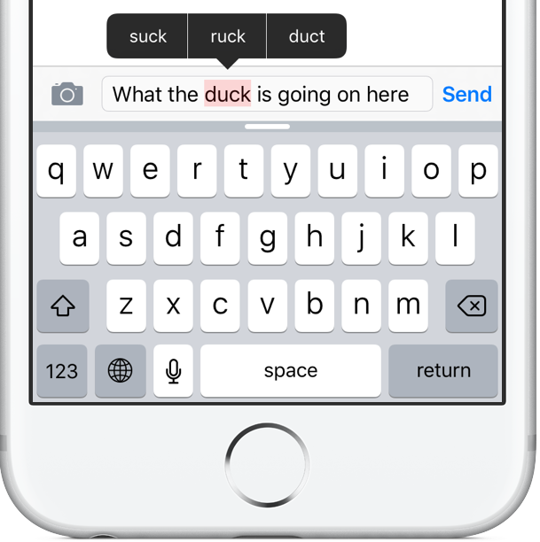

# AutoCorrectionModel

This repository provides a suite of tools for developing and implementing an auto-correction model using a corpus of Shakespeare's works. It includes functions for processing text, calculating word frequencies, generating word probabilities, and suggesting corrections for misspelled words. The project utilizes various text manipulation techniques, such as deletion, replacement, insertion, and swapping of characters, to generate possible corrections. Additionally, it calculates the minimum edit distance between words to determine the most probable corrections. This repository is ideal for exploring and building text correction algorithms, offering a comprehensive approach to text analysis and error correction.

<p align="center">
  
</p>

## Table of Contents
- [Installation](#installation)
- [Usage](#usage)
- [Functions](#functions)
  - [process_data](#process_data)
  - [get_count](#get_count)
  - [get_probs](#get_probs)
  - [delete_letter](#delete_letter)
  - [switch_letter](#switch_letter)
  - [replace_letter](#replace_letter)
  - [insert_letter](#insert_letter)
  - [edit_one_letter](#edit_one_letter)
  - [edit_two_letters](#edit_two_letters)
  - [get_corrections](#get_corrections)
  - [min_edit_distance](#min_edit_distance)
- [Example](#example)

## Installation

Clone the repository:
`git clone https://github.com/abdallaellaithy/Auto-Correction-Model.git` then
Navigate to the project directory

## Usage

Import the necessary modules and functions in your script or Jupyter notebook:
```python
import re
from collections import Counter
import numpy as np
import pandas as pd
from auto_correction_model import process_data, get_count, get_probs, delete_letter, switch_letter, replace_letter, insert_letter, edit_one_letter, edit_two_letters, get_corrections, min_edit_distance
```
# Functions
## process_data
### Processes a text file to extract words in lowercase.
```python
words = process_data('shakespeare.txt')
```
# get_count
## Generates a dictionary with word frequencies.
```python
word_count_dict = get_count(words)
```
# get_probs
## Calculates the probability of each word in the corpus.
```python
probs = get_probs(word_count_dict)
```
# delete_letter
## Generates all possible strings by deleting one character.
```python
delete_l = delete_letter('cans')
```
# switch_letter
## Generates all possible strings by switching adjacent characters.
```python
switch_l = switch_letter('eta')
```
# replace_letter
## Generates all possible strings by replacing one character.
```python
replace_l = replace_letter('can')
```
# insert_letter
## Generates all possible strings by inserting one new character.
```python
insert_l = insert_letter('at')
```
# edit_one_letter
## Generates all possible strings with one edit.
```python
edit_one_set = edit_one_letter('at')
```
# edit_two_letters
## Generates all possible strings with two edits.
```python
edit_two_set = edit_two_letters('at')
```
# get_corrections
## Suggests the most probable corrections for a misspelled word.
```python
corrections = get_corrections('dys', probs, vocab)
```
# min_edit_distance
## Calculates the minimum edit distance between two words.
```python
matrix, min_edits = min_edit_distance('play', 'stay')
```
# Example
```python
# Define a misspelled word
misspelled_word = "live"

# Get all possible corrections within two edits, allowing switches
corrections = edit_two_letters(misspelled_word, allow_switches=True)

# Filter corrections with edit distance of 1 and in vocabulary
recommended_words = []
for correction in corrections:
    _, min_edits = min_edit_distance(misspelled_word, correction, 1, 1, 1)
    if min_edits == 1 and correction in vocab:
        recommended_words.append(correction)

# Print recommended words
print("Recommended words for the misspelled word:", misspelled_word)
for recommended_word in recommended_words:
    print(recommended_word)
```


